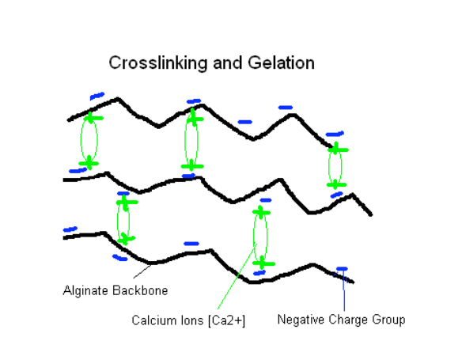

# BHV Workshop - Hydrogel 
 
_Biohacking Village DIY Workshops_
 
As part of our commitment to biohacking and open science, this 2019 DEF CON [Biohacking Village](https://www.villageb.io/)  workshop has been converted to a DIY/at home format. We hope you find this project instructive.
 
## About This Workshop
**Workshop leads:** JJ Hastings  
 
It’s time to say “Good bye and good riddance!” to those ethically problematic, resource-intensive animal-derived hydrogels and turn our attention to the wide array of plant-derived hydrogels we can use in 3D biofabrication! Added bonus: these planty-wanty hydrogels are tasty-tasty! In this workshop, you will learn how to isolate your own hydrogel material from a surprising food source. Then, you will get to work through forming and cross-linking your hydrogel using standard extrusion. Finally, you can play with your gelatinous food, making all sorts of disgustingly delicious delights.
 
## About Hydrogels

Hydrogels are crosslinked three-dimensional structures that can absorb and retain a significant amount of water without dissolving in it. Everyday examples include hair gel and gelatin desserts. Hydrogels have many uses in science and are fairly easy to make. They are being researched for 3-D biofabrication, pharmaceuticals, tissue engineering and various other biomedical application. 

Hydrogels are formed by the physical or chemical cross-linking of polymers. Physically crosslinked hydrogels are synthesized by ionic interaction, crystallization, stereocomplex formation, hydrophobized polysaccharides, protein interaction and hydrogen bond. Chemically crosslinked hydrogels are synthesized by chain growth polymerization, addition and condensation polymerization and gamma and electron beam polymerization. [Reference](http://article.sapub.org/pdf/10.5923.j.ajps.20140402.01.pdf)

For example: sodium alginate, a polysaccharide extracted from brown seaweed, can be physically cross-linked with heat and chemically cross-linked with calcium.

 
[Img: Chemical Cross-linking of Sodium Alginate](https://engineering.oregonstate.edu/momentum/k12/feb05/M!_GelBeads_final021405.pdf)

## Chemical Cross-linked Hydrogel - Edible Gummy Worms
This recipe / hydrogel protocol is based on the [Science and Gummy Worms by K LEE](https://eatitnoworeatitlater.com/2015/08/01/science-and-gummy-worms/)

### Materials

* Sodium alginate, powder (food grade)
* Flavor/candy extract (e.g. lemon, grape, rosewater)  [optional]
* Food coloring [optional]
* Calcium chloride, liquid (food grade)
* Water
* Blender 
* [Large syringe, 20ml](https://www.amazon.com/Frienda-Scientific-Dispensing-Multiple-Measuring/dp/B07JZ2HMJ7/)
* Large mixing bowl 
* Mesh strainer that fits inside the mixing bowl 
* Measuring cup 
* Measuring spoons 
* Mixing spoon

### Instructions

Step 1: Make the sodium alginate mixture 

* In the blender, put ¼ teaspoon sodium alginate 
* Add ½ cup room temperature water 
* Blend until dissolved 
* Add 1 tablespoon extract and food color [optional]
* Blend briefly to get even distribution of color 

Step 2: Make the calcium chloride solution 

* Put ¾ teaspoon calcium chloride and 2 ¼ cups water  in the mixing bowl 
* Stir until dissolved
* Put the mesh strainer into the bowl

Step 3: Make the Worms

* Draw the sodium alginate mixture into the syringe
* Move to the bowl and depress the plunger slowly and evenly. As the stream of sodium alginate mixture goes into the chloride mixture it will form a long “worm” strand. 
* Repeat until sodium alginate mixture is used
* Let worms firm in the calcium chloride solution for 1-2 minutes 
* Lift the mesh strainer filled with worms out of the bowl
* Rinse the worms with water to remove the calcium chloride salt
* Put worms into a dish and enjoy

=====

## Resources
 
[Hydrogel: Preparation, characterization, and applications: A review](https://www.sciencedirect.com/science/article/pii/S2090123213000969)

[Design properties of hydrogel tissue-engineering scaffolds
](https://www.ncbi.nlm.nih.gov/pmc/articles/PMC3206299/)

[3D Printed Edible Hydrogel Electrodes](https://ro.uow.edu.au/cgi/viewcontent.cgi?article=3824&context=aiimpapers)

[Hydrogels from Biopolymer Hybrid for Biomedical, Food, and Functional Food Applications](https://www.mdpi.com/2073-4360/4/2/997/htm)

[DIYbio 3 – Gel Electrophoresis](https://diybio.org/2008/07/14/diybio-3-gel-electrophoresis/)

[The GEL BEAD Process: A Journey to Jell-O Land](https://engineering.oregonstate.edu/momentum/k12/feb05/M!_GelBeads_final021405.pd)

[Transparent gel-based robots can catch and release live fish](https://www.sciencedaily.com/releases/2017/02/170201092647.htm)

[Make Water 'Bottles' You Can Eat](https://food-hacks.wonderhowto.com/how-to/make-water-bottles-you-can-eat-0154909/)
